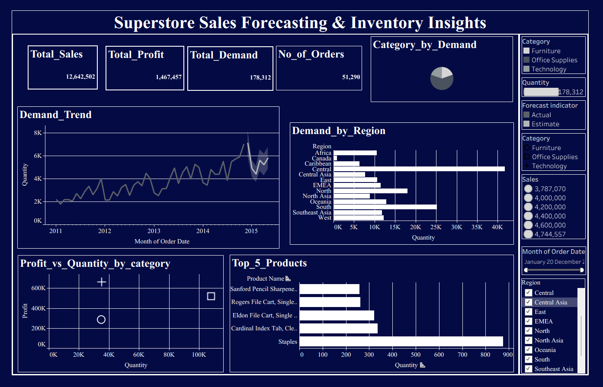
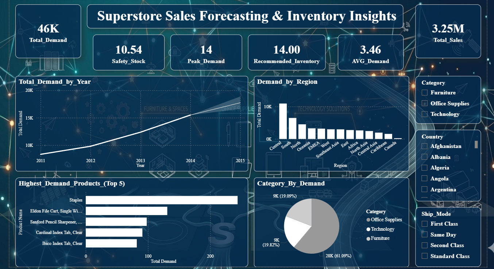
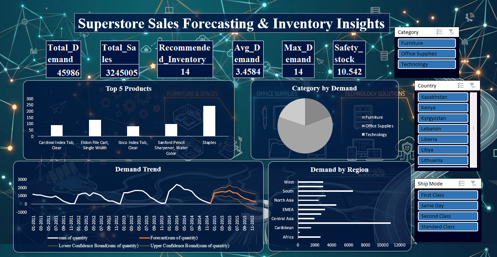

<h1 align="center"> Demand Forecasting & Inventory Optimization Dashboard</h1>

  <b>Tableau | Power BI | Excel | Demand Forecasting | Business Analytics</b>

This project, titled <b>"Superstore Sales Forecasting & Inventory Insights"</b>, 
analyzes historical sales data to identify demand patterns, forecast future demand, 
and recommend optimal inventory levels for improved decision-making.

<h2> Project Overview</h2>

This project focuses on analyzing historical sales data to forecast future demand and optimize inventory levels. 
The solution is implemented using <b>Tableau, Power BI, and Microsoft Excel</b> to provide a comprehensive and comparative view of data analysis and visualization techniques.

The dashboards help identify demand trends, high-performing products, and regional variations, enabling better inventory planning and reducing stockouts and overstock situations.

<h2> Objective</h2>

To analyze sales data and develop interactive dashboards that support demand forecasting and inventory optimization. 
The goal is to enable data-driven decision-making by identifying demand patterns, peak sales periods, and product performance trends.

<h2> Dashboards</h2>

<h3> Tableau Dashboard</h3>

  

<ul>
  <li>Demand trend analysis</li>
  <li>Regional demand distribution</li>
  <li>Top-performing products</li>
</ul>

<h3> Power BI Dashboard</h3>

  

<ul>
  <li>Forecasting indicators</li>
  <li>Inventory metrics (Safety Stock, Recommended Inventory)</li>
  <li>Demand insights by category and region</li>
</ul>

<h3> Excel Dashboard</h3>

  

<ul>
  <li>Pivot-based demand analysis</li>
  <li>Trend visualization</li>
  <li>Basic forecasting insights</li>
</ul>

<h2> Key Metrics</h2>
<ul>
  <li>Total Sales</li>
  <li>Total Profit</li>
  <li>Total Demand</li>
  <li>Number of Orders</li>
  <li>Average Demand</li>
  <li>Safety Stock</li>
  <li>Recommended Inventory</li>
</ul>

<h2> Key Insights & Recommendations</h2>
<ul>
  <li>
    Demand exhibits a consistent upward trend over time, indicating business growth and increasing market demand.  
     <b>Recommendation:</b> Align inventory planning with this growth trend to ensure sufficient stock availability and avoid stockouts.
  </li>

  <li>
    Significant variations in demand are observed across regions, with certain regions contributing a higher share of total demand.  
     <b>Recommendation:</b> Prioritize inventory allocation and distribution in high-demand regions to maximize sales and improve service levels.
  </li>

  <li>
    A small group of top-performing products contributes disproportionately to overall demand and sales.  
     <b>Recommendation:</b> Maintain higher safety stock levels for these products and ensure continuous availability to prevent revenue loss.
  </li>

  <li>
    Demand patterns show fluctuations across different time periods, highlighting the presence of peak demand cycles.  
     <b>Recommendation:</b> Implement demand forecasting techniques to anticipate peak periods and adjust inventory levels proactively.
  </li>

  <li>
    Forecasting-based metrics such as safety stock and recommended inventory provide a structured approach to inventory management.  
     <b>Recommendation:</b> Adopt data-driven inventory strategies to balance stock levels, reducing both overstocking costs and stockout risks.
  </li>
</ul>

<h2> Tools Used</h2>
<ul>
  <li><b>Tableau</b> – Data visualization</li>
  <li><b>Power BI</b> – Advanced analytics and forecasting</li>
  <li><b>Microsoft Excel</b> – Data analysis and dashboard creation</li>
</ul>

<h2> How to Use</h2>
<ol>
  <li>Download the files from respective folders</li>
  <li>Open using Tableau / Power BI / Excel</li>
  <li>Explore dashboards using filters and slicers</li>
</ol>

<h2> Author</h2>

<b>Anjana C</b> 
Aspiring Data Analyst | Business Analytics & Data Visualization

⭐ If you found this project useful, consider giving it a star!

